# Django Todo App - System Architecture

This document provides visual diagrams to help understand how the Django Todo application works.

---

## Application Architecture

### High-Level Overview

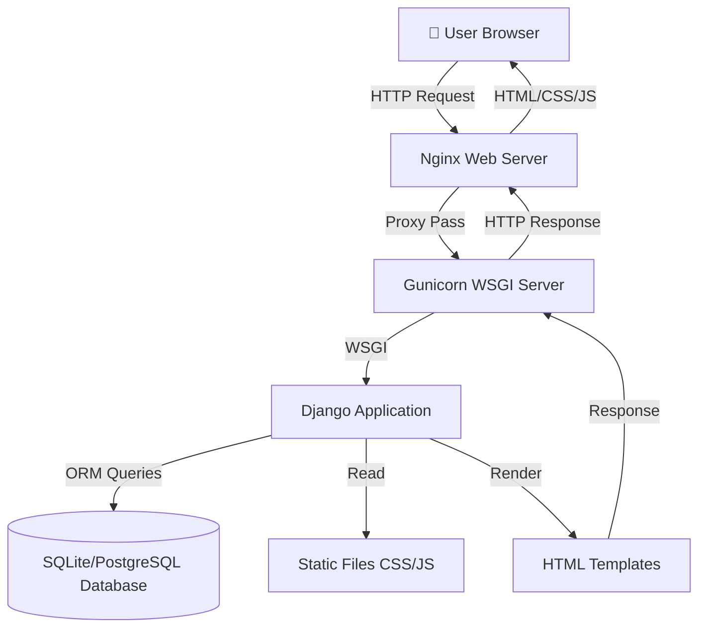

**ELI5**: When you visit the website, your browser talks to Nginx (the doorman), who passes your request to Gunicorn (the messenger), who gives it to Django (the brain). Django gets data from the database, creates an HTML page, and sends it back through the same chain.

---

## Django MVT Architecture

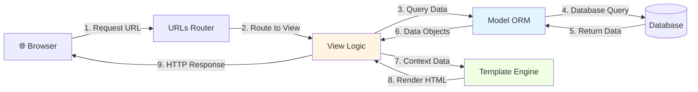

**Explanation**:
1. **Browser** requests `/todos/`
2. **URLs** matches pattern and routes to `TodoListView`
3. **View** asks Model for all todos
4. **Model** queries the database
5. **Database** returns todo records
6. **Model** converts to Python objects
7. **View** passes data to template
8. **Template** renders HTML with the data
9. **View** sends HTML back to browser

---

## Request-Response Cycle

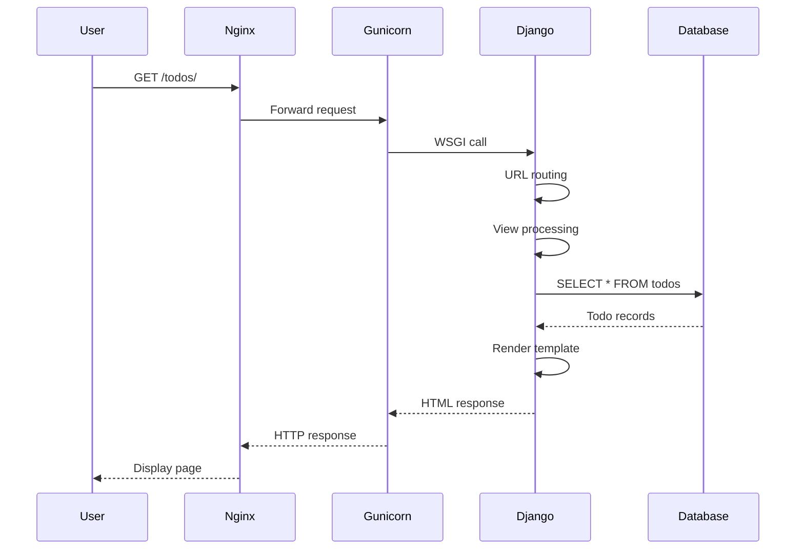

---

## Database Schema

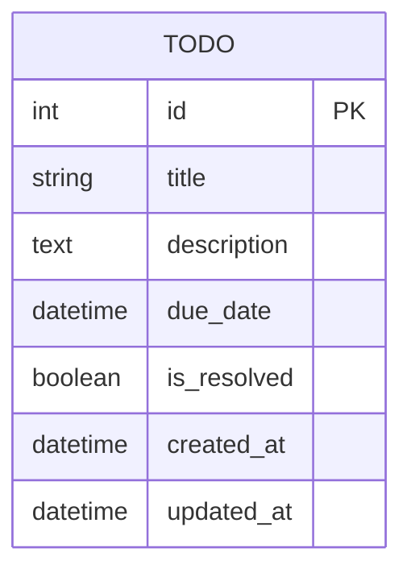

**Fields Explained**:
- `id`: Unique identifier (auto-generated)
- `title`: The todo's name (required)
- `description`: Extra details (optional)
- `due_date`: When it's due (optional)
- `is_resolved`: Completed or not (default: false)
- `created_at`: When it was created (auto)
- `updated_at`: Last modification time (auto)

---

## CRUD Operations Flow

### Create Todo

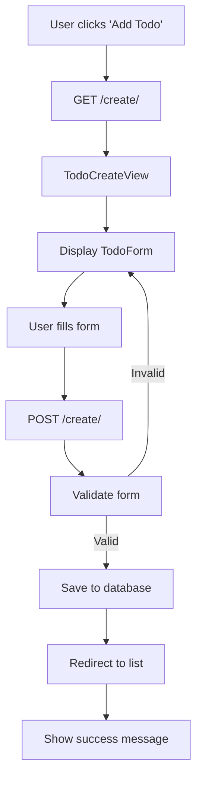

### Read Todos

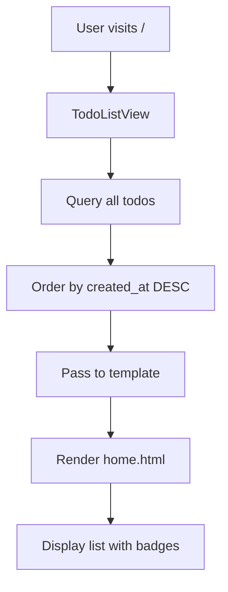

### Update Todo

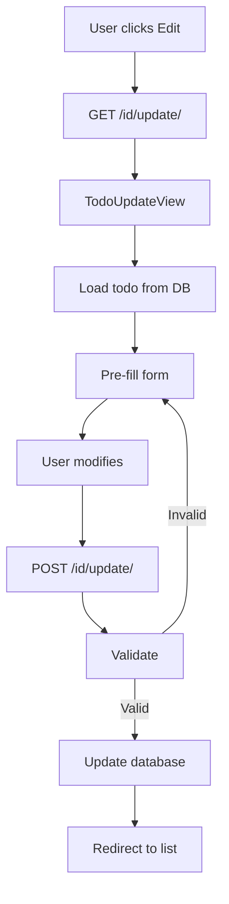

### Delete Todo

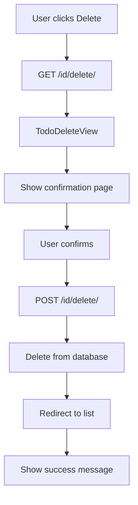

---

## Deployment Architecture

### Raspberry Pi Setup

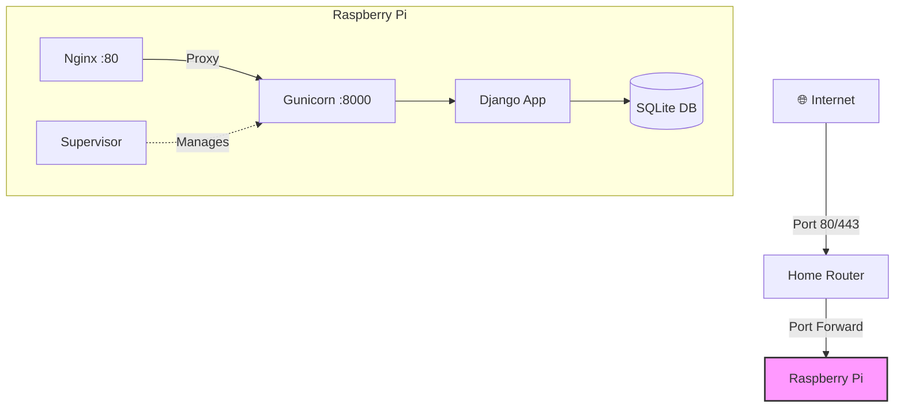

### Cloud Deployment (Railway/Render)

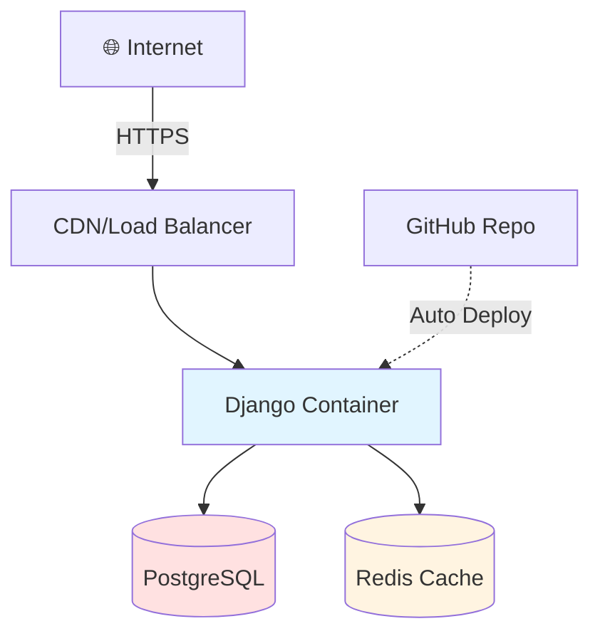

---

## Form Validation Flow

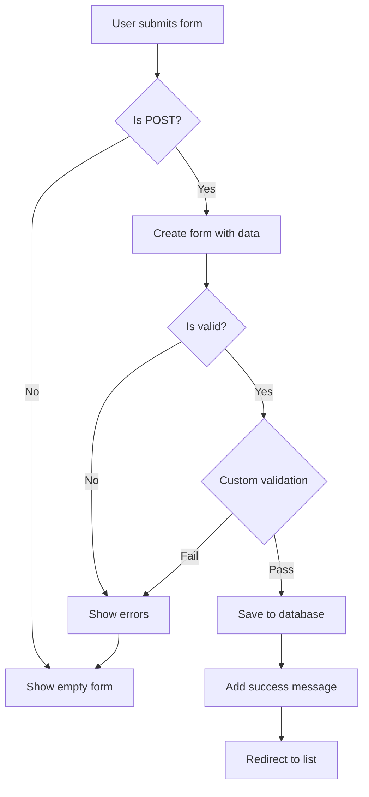

**Custom Validation Example**:
- Check if due_date is not in the past
- Ensure title is not empty
- Validate field lengths

---

## Authentication Flow (Future Enhancement)

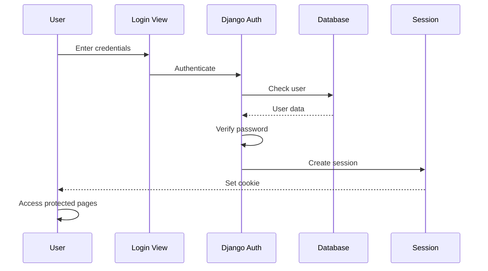

---

## Static Files Serving

### Development

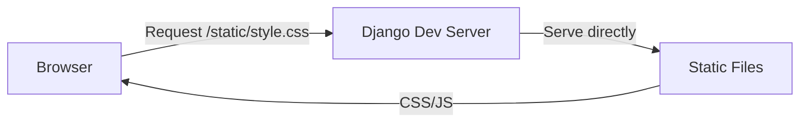

### Production

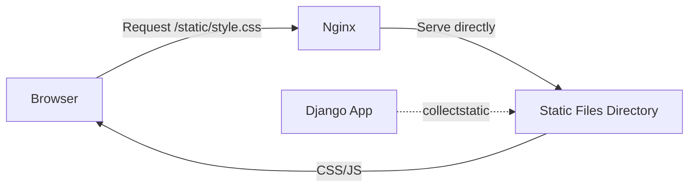

**Why different?**
- **Development**: Django serves static files (slow but convenient)
- **Production**: Nginx serves static files (fast and efficient)

---

## Testing Pyramid

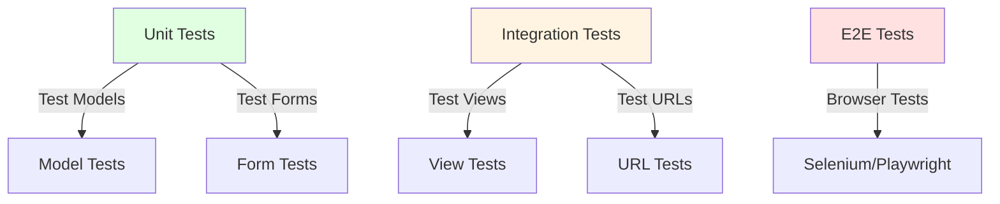

**Our Coverage**:
- ✅ Model Tests (creation, defaults, str)
- ✅ View Tests (GET/POST for all CRUD)
- ⚪ Form Tests (could add)
- ⚪ E2E Tests (could add)

---

## Performance Optimization Layers

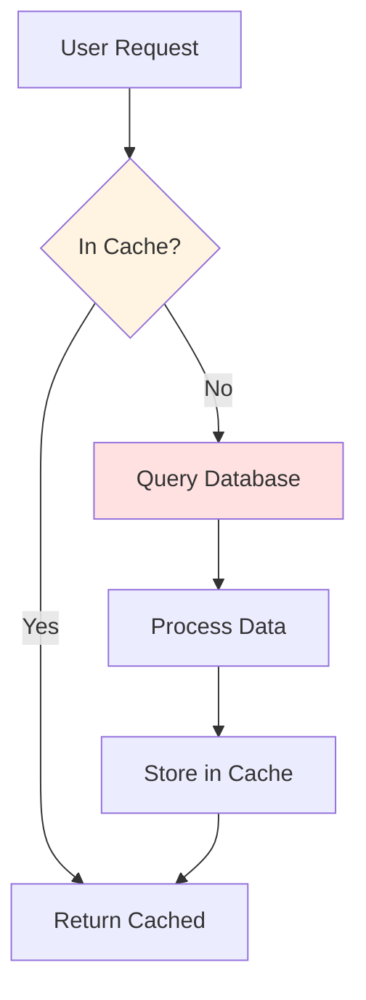

**Future Enhancements**:
1. Add Redis for caching
2. Database query optimization
3. CDN for static files
4. Lazy loading for images

---

## Security Layers

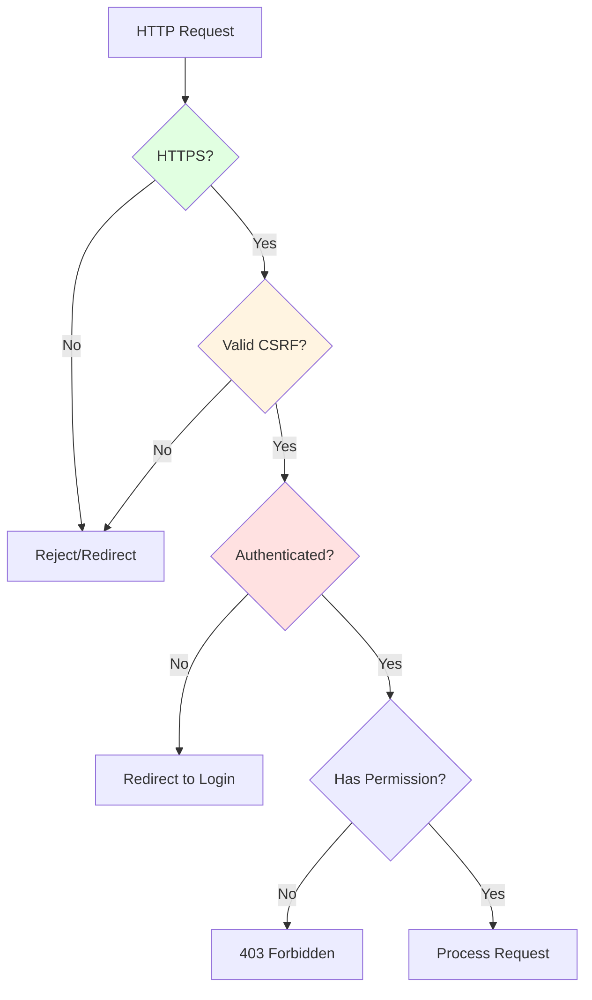

**Current Security**:
- ✅ CSRF protection (Django default)
- ✅ SQL injection prevention (ORM)
- ✅ XSS protection (template escaping)
- ⚪ HTTPS (needs configuration)
- ⚪ Authentication (not implemented yet)

---

## Monitoring & Logging

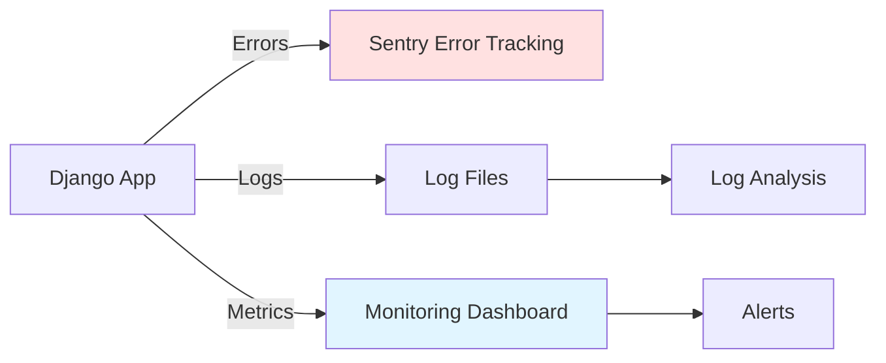

---

These diagrams provide a visual understanding of how the Django Todo application works at different levels. Use them as reference when learning or explaining the system to others!
